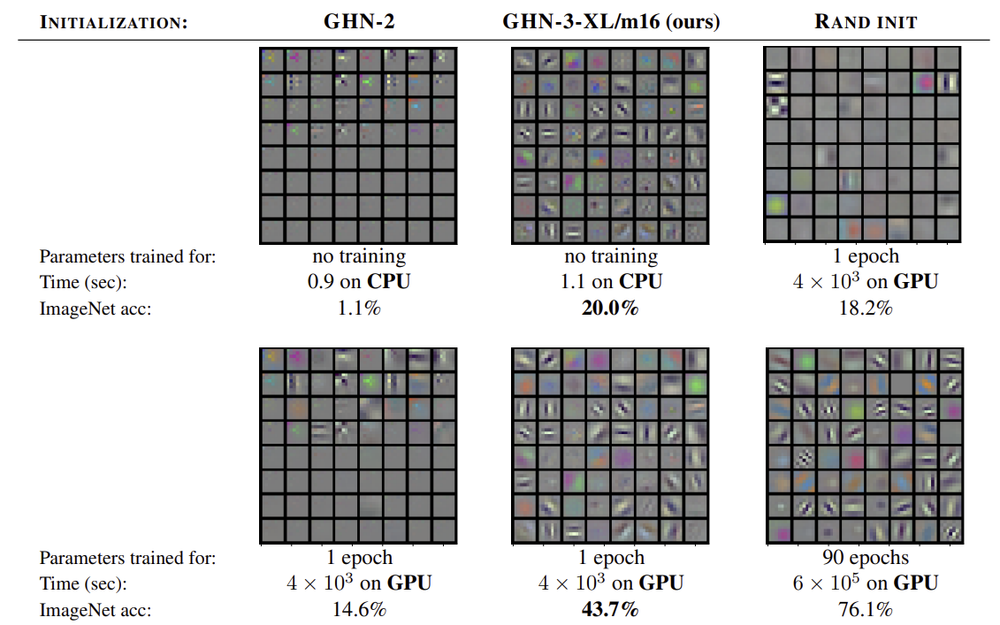
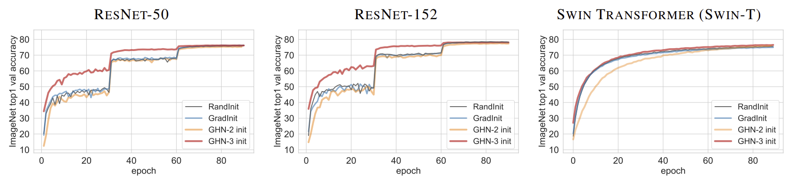

# Can We Scale Transformers to Predict Parameters of Diverse ImageNet Models?

**ICML 2023 [`link to the poster, slides and video presentation`](https://icml.cc/virtual/2023/poster/24569)**, [`tweet`](https://twitter.com/BorisAKnyazev/status/1633443437851598852)

[Boris Knyazev](http://bknyaz.github.io/), [Doha Hwang](https://mila.quebec/en/person/doha-hwang/), [Simon Lacoste-Julien](http://www.iro.umontreal.ca/~slacoste/)

Paper: https://arxiv.org/abs/2303.04143, https://openreview.net/forum?id=7UXf8dAz5T

# Introduction

**Updates**

- [July 11, 2023] Sync changes with the recent [PPUDA/GHN-2](https://github.com/facebookresearch/ppuda/) updates, 
  - [timm](https://github.com/huggingface/pytorch-image-models) training recipes added from [ResNet strikes back](https://arxiv.org/abs/2110.00476)
  - Video presentation of our paper is now available at [this link](https://recorder-v3.slideslive.com/?share=82913&s=2547b532-e0e2-462b-9312-4ab3dd1fa72a)
- [June 26, 2023] Training and eval on CIFAR-10 and eval on the DeepNets splits are supported.
- [June 22, 2023] Major code refactoring. 
  - Distributed (DDP) training and eval scripts added (see [Experiments](#experiments) below).
- [June 6, 2023] GHN-3 code improved (see [ghn3/nn.py](ghn3/nn.py)), more examples added (see [ghn_single_model.py](examples/ghn_single_model.py)).
- [Apr 11, 2023] Cleaned up graph construction, sanity check for all PyTorch models.
- [Apr 4, 2023] Slightly updated graph construction for ViT to be consistent with our paper. 
  - Made four variants of our GHN-3 available: `ghn3tm8, ghn3sm8, ghn3lm8, ghn3xlm16` (see updated [ghn_all_pytorch.ipynb](examples/ghn_all_pytorch.ipynb)). `ghn3tm8` takes just 27MB so it is efficient to use in low-memory cases.
 

This work extends the previous work [`Parameter Prediction for Unseen Deep Architectures`](https://github.com/facebookresearch/ppuda/) that introduced improved Graph HyperNetworks (GHN-2).
Here, we scale up GHN-2 and release our best performing model `GHN-3-XL/m16` as well as smaller variants. 
Our GHN-3 can be used as a good initialization for many large ImageNet models. 

Below are a few figures showcasing our results (see [our paper](https://arxiv.org/abs/2303.04143) for details).


<figure> </figure>

<figure> </figure>

<figure> </figure>


Our code has only a few dependencies and is easy to use as shown below with PyTorch examples.

Please feel free to open a GitHub issue to ask questions or report bugs. 
Pull requests are also welcome.

# Installation

```
# If you didn't install ppuda before:
pip install git+https://github.com/facebookresearch/ppuda.git

# If you had ppuda installed before, you need to reinstall it, because it was updated recently:
pip install git+https://github.com/facebookresearch/ppuda.git --no-deps --upgrade --force-reinstall

pip install torch>=1.12.1 torchvision>=0.13.1  # [optional] update torch in case it's old

pip install huggingface_hub joblib # to load pretrained GHNs

pip install timm  # [optional] to use fancy optimizers like LAMB

```

# Imagenet

For training and evaluation on ImageNet, one needs to setup 
ImageNet as in [scripts/imagenet_setup.sh](scripts/imagenet_setup.sh).

**Training and evaluation on CIFAR-10 is now also supported, however, it was not presented in the paper.**

# Usage

```
import torchvision
from ghn3 import from_pretrained

ghn = from_pretrained()  # default is 'ghn3xlm16.pt', other variants are: 'ghn3tm8.pt', 'ghn3sm8.pt', 'ghn3lm8.pt'

model = torchvision.models.resnet50()  # can be any torchvision model
model = ghn(model)

# That's it, the ResNet-50 is initialized with our GHN-3.
```


GHN-3 is stored in HuggingFace at 
https://huggingface.co/SamsungSAILMontreal/ghn3/tree/main.
As the largest model (`ghn3xlm16.pt`) takes about 2.5GB, 
it takes a while to download the model during 
the first call of `ghn = from_pretrained()`.

See [ghn_single_model.py](examples/ghn_single_model.py) for the examples of fine-tuning the model or GHN.
Also see [ghn_all_pytorch.ipynb](examples/ghn_all_pytorch.ipynb) where we show how to predict parameters for all PyTorch models.

# Experiments

These scripts allow for training and evaluation of PyTorch models and GHN-3 and comparing to the baselines as in our paper.
Training will be automatically run using `DistributedDataParallel` on all GPUs available if the script is run using `torchrun`.
See command examples in [train_ghn_ddp.py](train_ghn_ddp.py) and [train_ddp.py](train_ddp.py).

- For training GHN-3 see commands in [train_ghn_ddp.py](train_ghn_ddp.py).
- For evaluating GHN-3 see commands in [eval_ghn.py](eval_ghn.py) (make sure to use `--split torch` for evaluation on PyTorch).
- For training PyTorch models with and without GHN-3 initialization see commands in [train_ddp.py](train_ddp.py).
- For evaluating PyTorch models see commands in [eval.py](eval.py).

# License

This code is licensed under [MIT license](LICENSE) and is based on
https://github.com/facebookresearch/ppuda that is also licensed under [MIT license](https://github.com/facebookresearch/ppuda/blob/main/LICENSE).

# Citation

```
@inproceedings{knyazev2023canwescale,
  title={Can We Scale Transformers to Predict Parameters of Diverse ImageNet Models?},
  author={Knyazev, Boris and Hwang, Doha and Lacoste-Julien, Simon},
  booktitle={International Conference on Machine Learning},
  year={2023}
}
```


